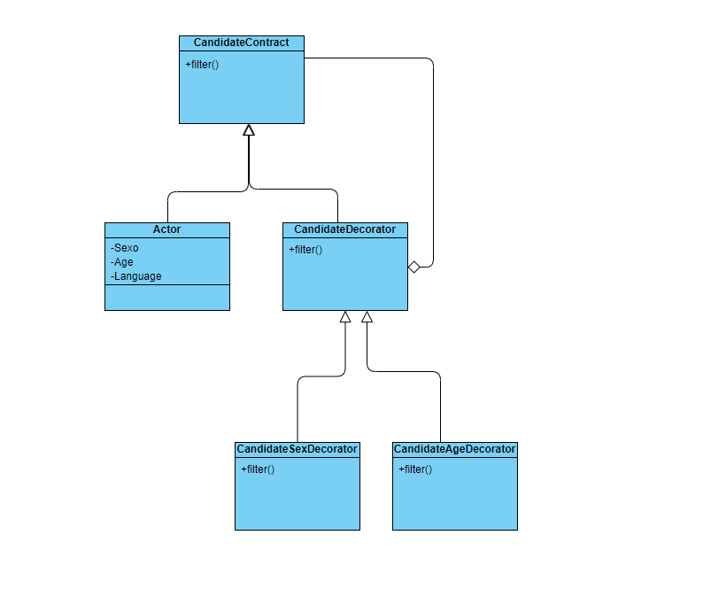

# Prueba Senior Back-end

## Instrucciones sobre la realización de la prueba
La prueba tiene una duración máxima de dos horas y media. Está formada por dos preguntas, la primera de ellas es una pregunta puramente de programación para analizar los conocimientos que tienes sobre arquitectura DDD/Clean Arquitecture. La segunda pregunta está orientada a saber cómo estructurar a nivel de clases cierta funcionalidad.

## PREGUNTA 1

En esta pregunta pedimos una solución orientada a una arquitectura **DDD/Clean Arquitecture**.

En el repositorio tiene un proyecto Laravel 8 prácticamente limpio. Las únicas modificaciones que se han realizado son las siguientes:

- Se ha creado las migraciones necesarias para realizar la prueba.
- Se ha configurado el fichero phpunit.xml para que pueda ejecutar las pruebas sobre una conexión de SQLite. Puede modificar este fichero si prefiere ejecutar las pruebas sobre una conexión mysql, por ejemplo.

Imagina que tenemos la siguiente base de datos:

budgets

- id - primary key, int autoincrement
- total_amount - decimal 10,2
- created_at - timestamp
- update_at - timestamp
- deleted_at - timestamp

budget_lines

- id - primary key, int autoincrement
- budget_id - FK a la tabla *budgets*
- total_amount - decimal 10,2
- net_amount - decimal 10,2
- vat_amount - decimal 10,2
- vat - decimal 10,2
- created_at - timestamp
- update_at - timestamp
- deleted_at - timestamp

y nos piden realizar las siguientes tareas para que la API sea capaz de obtener y crear un presupuesto.

TAREA T1

La API tiene que ser capaz de recibir una petición POST api/invoices y ser capaz de crear un presupuesto. El DTO de llegada será de este tipo:

- Array de budgetLine

budgetLine a su vez, será un DTO de este tipo:

- netAmount (decimal, requerido)
- vat (decimal, requerido)
- vatAmount (decimal, requerido)

El importe del IVA (vatAmount) se calcula: (netAmount * vat) / 100.

La cantidad total de una línea de presupuesto se calcula a partir de la suma de la cantidad neta (netAmount) y el importe del IVA (vatAmount).

La cantidad total de un presupuesto será la suma de las cantidades totales de todas las líneas del presupuesto.

**Se debe crear todos los Unit, Feature tests necesarios para testear la funcionalidad**

TAREA T2

La API tiene que ser capaz de obtener un presupuesto dependiendo del ID de la misma, al recibir una petición de este tipo GET api/invoices/{invoiceId}. El resultado que debe devolver la API debe ser el siguiente:

- budgetId
- Array de budgetLine
- totalAmount
- createdAt

budgetLine a su vez será un DTO de este tipo:

- budgetLineId
- netAmount
- vatAmount
- totalAmount
- createdAt

**Para esta tarea SÓLO se debe crear Feature tests necesarios para testear la funcionalidad**

## PREGUNTA 2

Imagina que tenemos un listado de actores/actrices con una serie de características/atributos: sexo, edad, altura, idioma, etc.

Negocio nos pide poder elegir a los candidatos que más encajen según una serie de criterios, por ejemplo: "Queremos seleccionar a todas las actrices mayores de 40 años".

Explica el diagrama de clases que deberá tener esta funcionalidad teniendo siempre presente que a lo largo del tiempo se podrán crear y desactivar filtros. **Importante**: no se pide codificar ninguna solución, se pide explicar el diagrama de clases.

## SOLUCIÓN PROPUESTA

## -PREGUNTA 1
La implementación para las tareas 1 y 2, se encuentran dentro del /src.

## -PREGUNTA 2
Para el diagrama de clases he utilizado el patrón Decorator. Este patrón nos permitiría añadir y eliminar filtros de los actores de forma dinámica, para de esta forma ajustarse al ejercicio propuesto.

